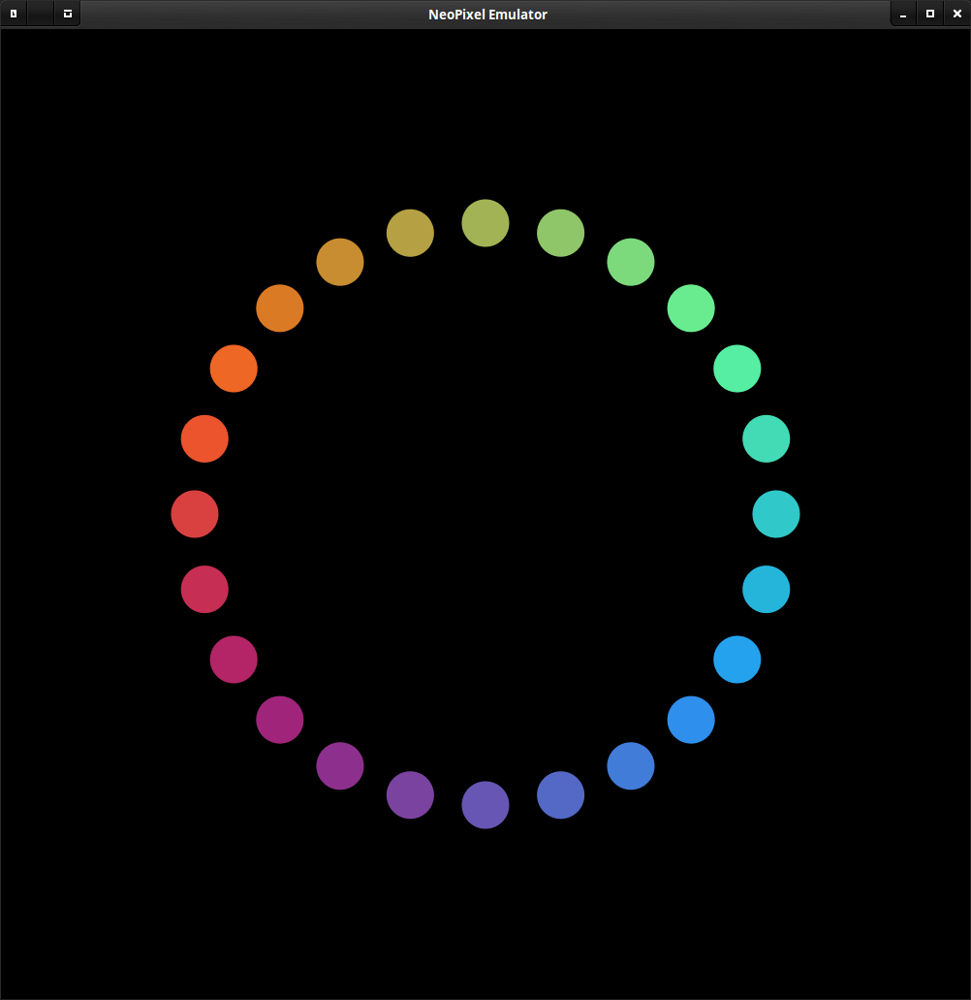

#### Adafruit NeoPixel Emulator

This is a tool to speed up development of animated patterns for [WS2812B](https://www.adafruit.com/datasheets/WS2812B.pdf) RGB LEDs that are supported by the [Adafruit NeoPixel](https://www.adafruit.com/category/168) library for Arduino. It consists of a library that has the same interface as the NeoPixel library but that, instead of writing to actual WS2812B LEDs, renders the LEDs on screen using OpenGL. In addition, there's simple adapter code and implementations of a couple of the most common functions used in Arduino sketches (`delay()`, `random()` and `millis()`).

This allows an Arduino sketch that uses only the Adafruit NeoPixel library and the supported functions to be compiled and linked on the PC, enabling a shorter development cycle and easy debugging for WS2812B blinky projects.

After implementing the desired effects on the PC, the sketch can be copied unchanged to the Arduino environment, built there and then used for programming one of the Atmel microcontrollers supported by the Adafruit NeoPixel library.

Currently, only rendering of Adafruit NeoPixel Rings, like the [24 LED Ring](https://www.adafruit.com/products/1586) has been implemented, with ring and LED diameters set to look somewhat like that particular product.

#### Setup and Use

As Douglas Adams may have said, getting things up and running with this app is almost, but not quite, entirely unlike gettings things running on an Arduino. It's not plug and play, but should be worth the up front cost when implementing patterns that are not completely basic. At least, that was the case for me, when using this for developing for a DigiSpark ATtiny85, which must be unplugged and plugged back into the USB port each time the code is updated (which can be hundreds, or thousands of times when tweaking parameters for animated effects, etc). 

No part of the Arduino IDE or libraries are used in this project. It's a regular PC app written in C++ and based on FreeGLUT. It has just been set up in such a way that one of the `.cpp` files can also be used as an Arduino sketch. The app is tested only on 64-bit Linux but should compile and run on any platform where FreeGLUT is available, such as Mac and Windows).      

These instructions should work on Ubuntu, Mint and other Debian based systems. Tested on Mint 17.2.

##### makeheaders

The main difference between an Arduino sketch and a regular .cpp file is that sketches have automatically generated prototypes. We use the [makeheaders](http://www.hwaci.com/sw/mkhdr/makeheaders.html) for this task.
 
Set up makeheaders:

    $ wget http://www.hwaci.com/sw/mkhdr/makeheaders.c
    $ gcc -o makeheaders makeheaders.c

##### freeGLUT

    $ sudo apt-get install freeglut3-dev

##### OpenGL

You also need OpenGL drivers. These are specific to your graphics card and there's a good chance you already have them. If they appear to be missing, it's worth a try to set up the Mesa drivers:

    $ sudo apt-get install mesa-common-dev (*install these only if you need them*)
    
##### source

Grab this code directly via `git`. `cd` to the directory, then:

    $ make.sh && ./emulator
    
* Watch the blinkies on screen. Then exit by closing the window or hitting Ctrl-C in the shell.

* Tweak rgb_sketch.cpp to make your own patterns.

* Debug with a regular debugger or use `printf()` statements (the output appears in the shell).

* When done, copy paste the rgb_sketch.cpp code into the Arduino IDE and write it to your device.

